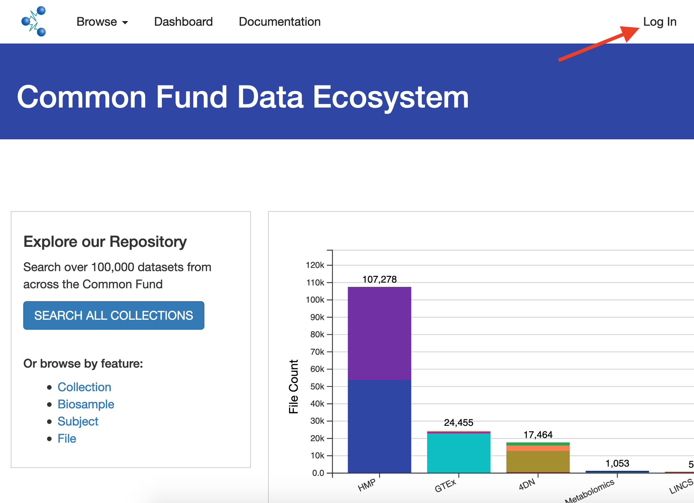
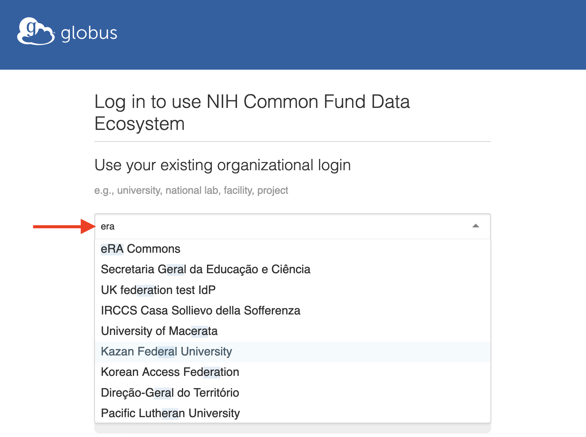
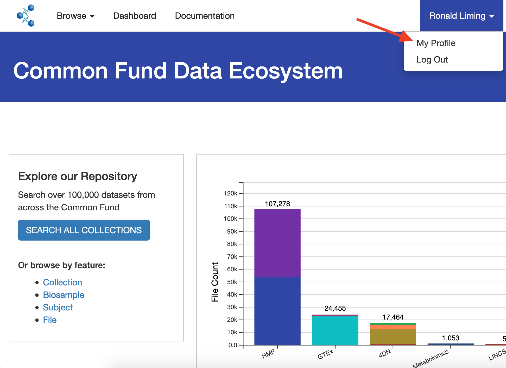
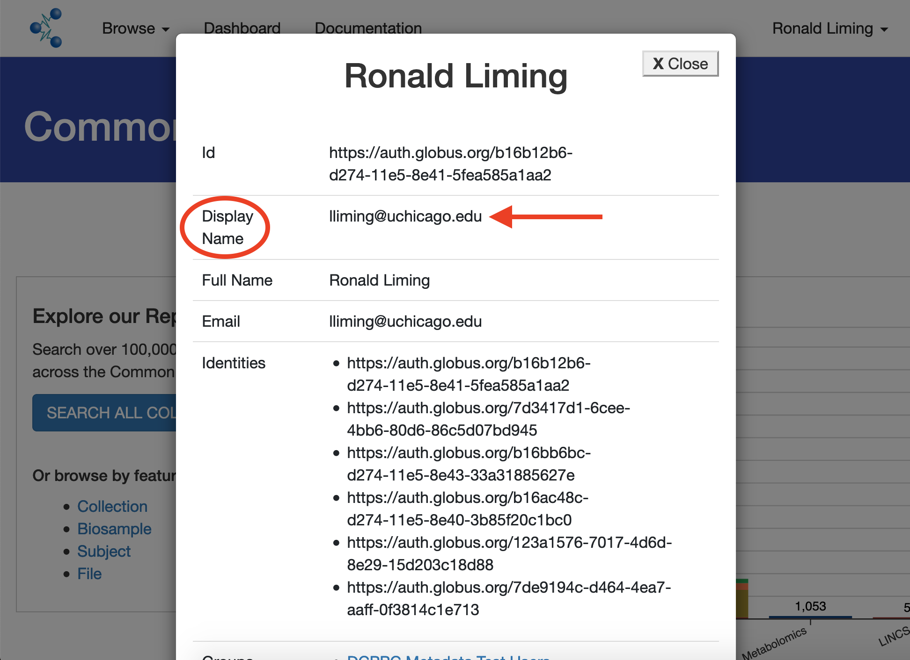
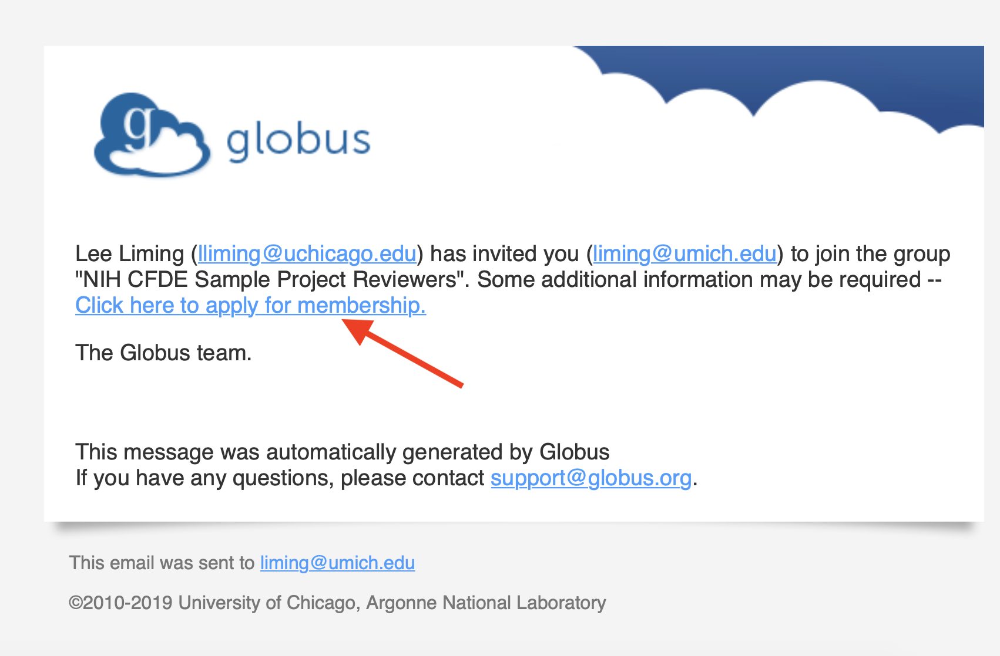
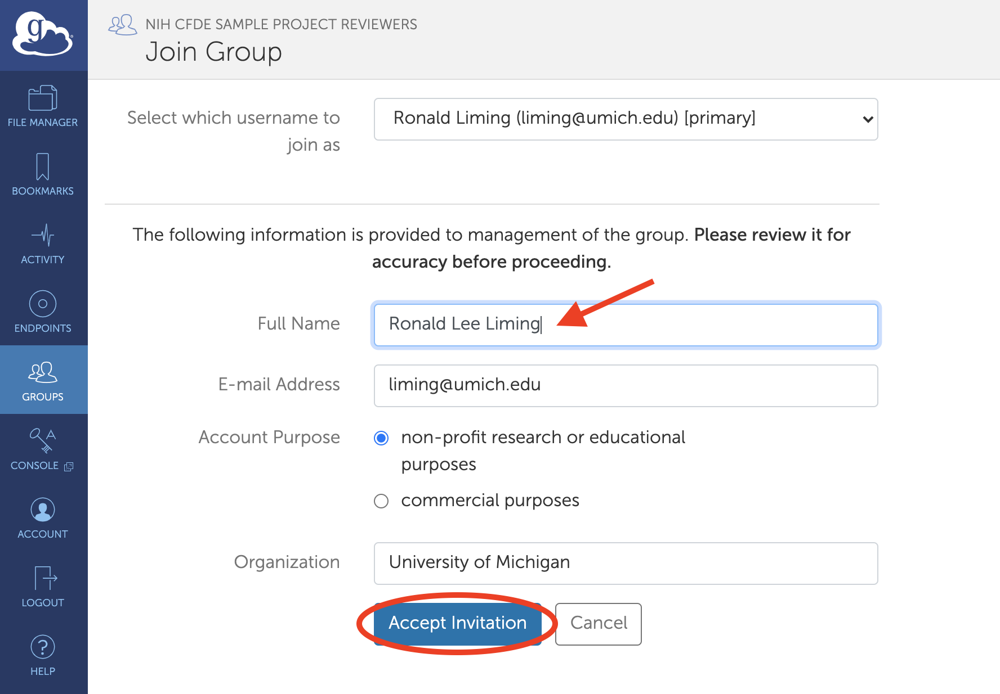

# Recommended instructions for DCC PIs during Epic 1

During October 2020, the CFDE portal is offering a preview of our description of your data holdings based on a C2M2 rendering of the data on your public portal. Access to your project's review area in the CFDE portal is restricted to authorized members of your team. Please use the following instructions to authorize members of your team to access your review area in the CFDE portal during October.

## Find your display name

Please visit the [CFDE portal](https://app.nih-cfde.org/) and click `Log In` in the upper right corner of the page.

The portal will offer a choice of organizations. We encourage you to use an organization you are already registered with, if possible. (Options include your university, eRA Commons, ORCID, etc.) You may also login using any Google ID or create a new Globus ID, but we recommend an identity you are already using.

Once you've logged in, your name will be displayed in the upper right corner, and clicking your name will pull down a menu. Select `My Profile` from this menu.

On the profile screen, look for the line labeled `Display Name.` Please copy the value displayed here: this is what we need to give you access to your review area.

Once you've copied your display name, you may log out of the portal if you prefer, or just close the browser window.

## Collect your team's display names and send to CFDE

Now, ask your team members who need to access your project's review area to do this and send you their display names.

When you have the display names for your team, send an email message to __________, listing the display names for your team, and noting which one belongs to you, the PI.  We'll take care of the rest!

## Accepting your invitation

Shortly after you send your message, you and your team members should receive an email invitation to join your reviewers group. The message will have a link in it.

Click the link and login if necessary, choosing the same organization as before. After logging in, your browser will go directly to the `Join Group` page. You may change any of the profile fields. When you are ready, click `Accept Invitation`.

You may now close your browser.

If you need to add or remove any authorized viewers during the review period, send us another email with the instructions and any related display names.

## Viewing your project's review area

Once you accept your invitation, you'll have access to your review area in the CFDE portal. Return to the CFDE portal.

If your name is displayed in the upper right corner, you're already logged in. If not, click `Log In` and login using the same organization as above. Once you're logged in, you'll be able to access your review area.
