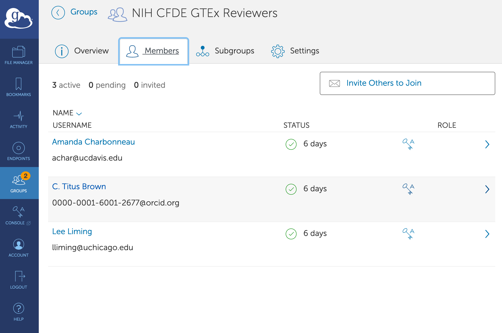
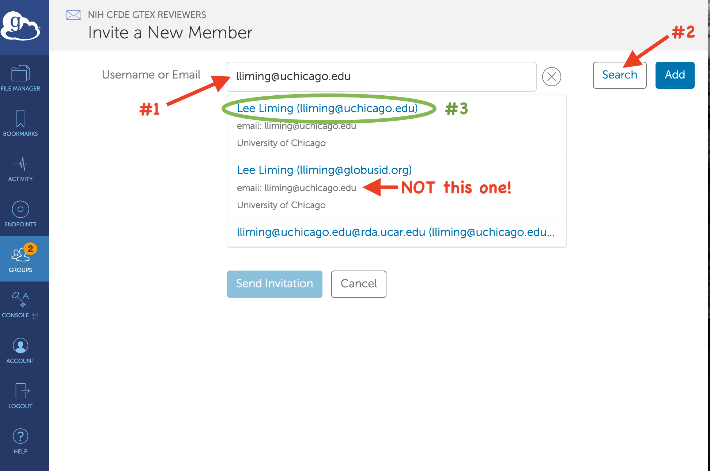
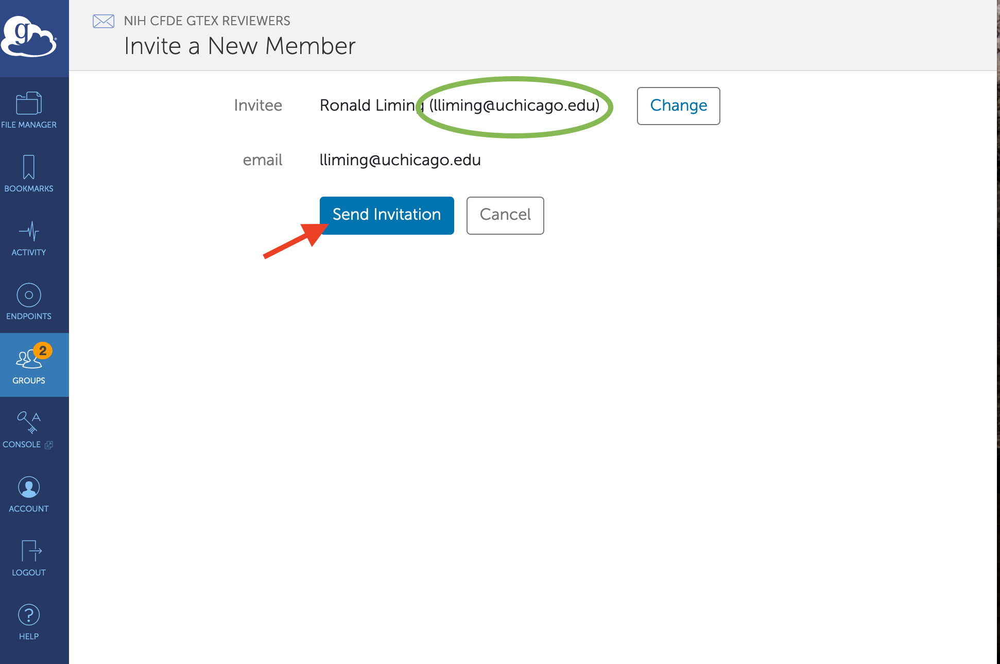
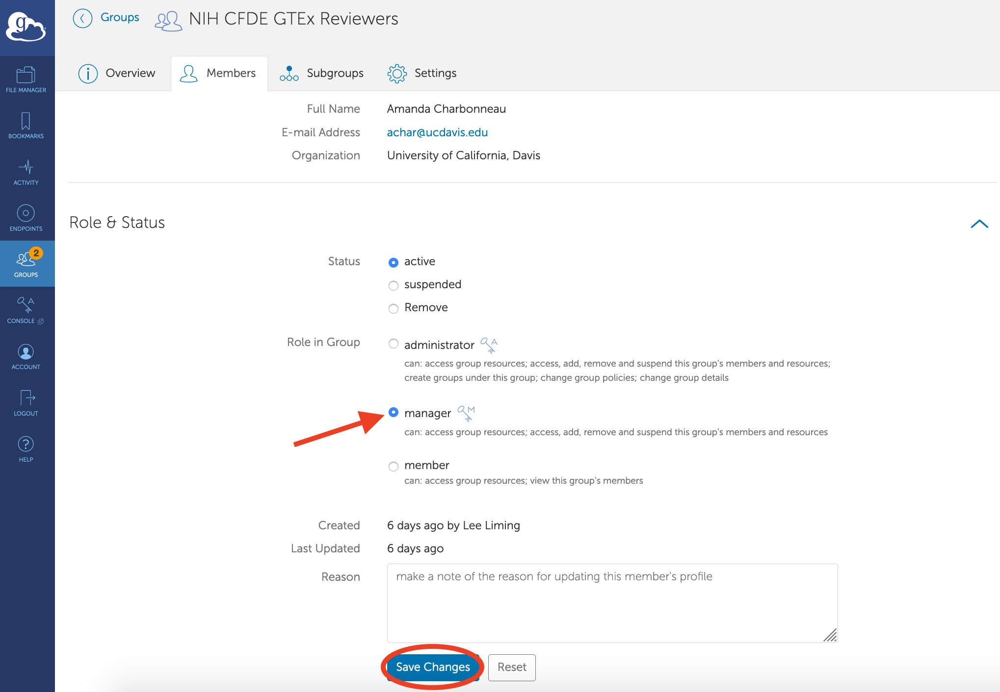

# Recommended group management for Epic 1

Send [instructions to each DCC PI](dcc-instructions.md) informing them about the preview period and how to register themselves and their teams.

## Adding DCC Reviewers

When you receive email from a DCC PI with a list of display names, click a link below to visit the relevant group in the Globus web app.

_NOTE: To administer these groups, you must be logged into Globus using the identity that administers the group or any linked identity. If you can't administer the group, log out of Globus and log back in, taking care to use an identity that administers the group._

| DCC | Reviewer Group |
|-----|----------------|
| GTEx | [NIH CFDE GTEx Reviewers](https://app.globus.org/groups/7977181e-f82f-11ea-b43a-0efde36f5027/about) |
| Kids First | [NIH CFDE Kids First Reviewers](https://app.globus.org/groups/1863c500-f831-11ea-b43d-0efde36f5027/about) |
| HMP | [NIH CFDE HMP Reviewers](https://app.globus.org/groups/4e335e29-f831-11ea-b43e-0efde36f5027/about) |
| MoTrPAC | [NIH CFDE MoTrPAC Reviewers](https://app.globus.org/groups/8a32410e-f831-11ea-880f-0ac4e6b272c3/about) |
| Metabolomics | [NIH CFDE Metabolomics Reviewers](https://app.globus.org/groups/f423d7d8-f831-11ea-a93a-0a738d2d09bf/about) |
| LINCS | [NIH CFDE LINCS Reviewers](https://app.globus.org/groups/2b14318d-f832-11ea-880f-0ac4e6b272c3/about) |
| 4DN | [NIH CFDE 4DN Reviewers](https://app.globus.org/groups/642533ba-f832-11ea-880f-0ac4e6b272c3/about) |

Click the Members tab and review the current members, then click the "Invite Others to Join" button.

On the "Invite a New Member" screen, type a display name given to you by the DCC PI, then click the Search button. In the list that appears, look for the one entry where the larger, blue text matches the display name you entered. _Ignore email addresses, even if they match!_

Click the matching search result, then double check the Invitee name, and take note of the email address associated with it. (This is where the invitation will be sent.) Click "Send Invitation".

Return to the Members tab for the group and add any other DCC reviewers to the group. The member list displays pending invitations. These will change to normal members when the invitations are accepted.

When an invitation is accepted, the invitee will have access to their review interface in the CFDE portal.

## Upgrading DCC PIs to group managers

When you add a DCC PI to a group, you may upgrade their role in the group to a Manager after they accept the group invitation. A group's managers can view, add, remove, and suspend group members for the group.

On the Members tab for the group, click the name of the DCC PI or the right-pointing arrow on the right side of their row in the member list. On the member screen, scroll down to the Roles & Status section, and change the Role in Group to "Manager". Be sure to click "Save Changes" when you're finished!

This role change is immediate. The DCC PI will now be able to add, remove, or suspend membership in the group.

_Do not assign the Administrator role to DCC PIs._ Administrators can delete the group. The relationship between the CFDE portal and the group isn't easy to recreate if the group is deleted, so we don't want to delete these groups while they're being used in the CFDE portal.
